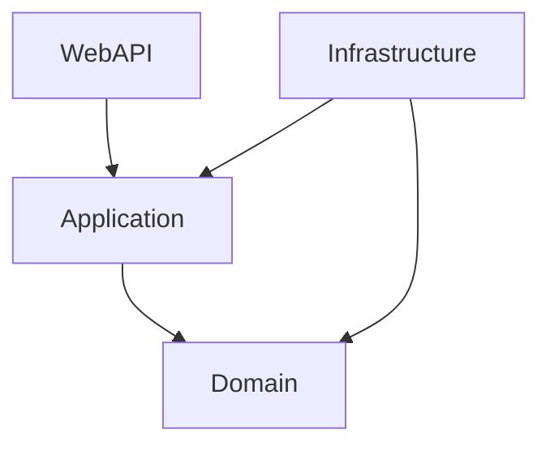

# 🔷 App.Trading.Algoritmico.Api (.NET 10)

Backend estandarizado utilizando **.NET 10**, **Clean Architecture** y **Entity Framework Core 10**.

## 🛠️ Tecnologías Clave
- **.NET 10**: Primary Constructors, Minimal APIs.
- **EF Core 10**: Interceptors, Fluent API, Migrations.
- **HotChocolate**: GraphQL Server.
- **Serilog / OpenTelemetry**: Observabilidad.
- **xUnit / FluentAssertions**: Testing.
- **ASP.NET Core Identity**: Autenticación y roles.

## 🧠 Skills Activos

Los siguientes skills definen las reglas de desarrollo para este proyecto:

| Skill | Descripción | Patrones Clave |
|-------|-------------|----------------|
| **clean-architecture** | Estructura de capas | Dependency Rule, CQRS, AutoMapper |
| **csharp-dotnet** | Estilo de codificación | File-scoped namespaces, Required props |
| **webapi-patterns** | Exposición de APIs | REST Controllers, GraphQL, Middleware |
| **external-integrations** | Consumo de APIs externas (brokers) | Refit, Polly (Circuit Breaker/Retry) |
| **entity-framework** | Acceso a Datos | Fluent API, Migrations, Interceptors |
| **auditing** | Auditoría de operaciones | HTTP Audit Middleware, Masking |
| **testing** | Pruebas Automatizadas | xUnit, Moq, WebApplicationFactory |
| **security** | Seguridad | JWT, Identity, Policies, CORS |

## 🚀 Ejecución

Para levantar el proyecto independientemente:

```bash
# Workflow (Recomendado)
@[/run-host]

# Manual
dotnet run --project src/AppTradingAlgoritmico.WebAPI
```

Acceso:
- **Swagger**: [https://localhost:5001/swagger](https://localhost:5001/swagger)
- **GraphQL**: [https://localhost:5001/graphql](https://localhost:5001/graphql)

## 🏗️ Arquitectura


