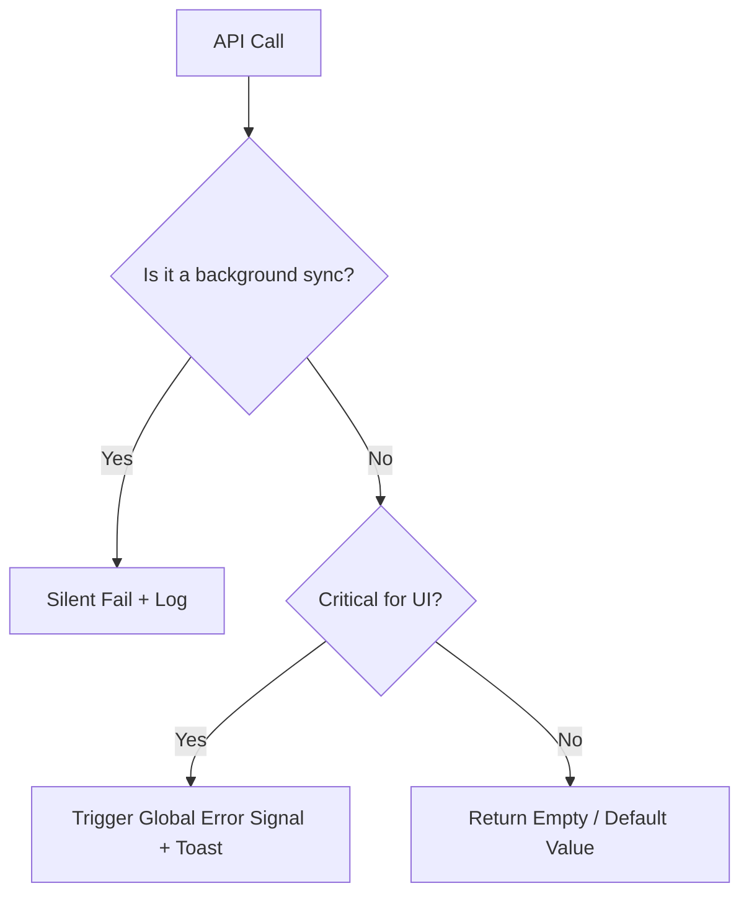

## When to Use

Use this skill when:
- Creating new API services (`*ApiService` or `*DataService`).
- Defining data structures for API responses (`*DTO`) and UI consumption (Domain Models).
- Implementing HTTP request handling and error management.
- Managing server state using Signals.

---

## Critical Patterns

### Pattern 1: The Transformation Pipeline (DTO -> Model)
> **Rule**: Every API response must have a DTO interface and a Mapper function. Models used in UI must be clean and decoupled from the backend shape.

```typescript
// 1. DTO: Exact backend response (snake_case, technical fields)
export interface ProductDTO {
  p_id: string;
  price_val: number;
  attr: any[];
}

// 2. Domain Model: Clean interface for UI (camelCase, semantic fields)
export interface Product {
  id: string;
  price: number;
  hasAttributes: boolean;
}

// 3. Mapper: Pure function for transformation
export const mapProduct = (dto: ProductDTO): Product => ({
  id: dto.p_id,
  price: dto.price_val,
  hasAttributes: dto.attr && dto.attr.length > 0
});
```

### Pattern 2: Signal-Based Data Fetching
> **Rule**: Use `toSignal` for read-only streams and `inject(HttpClient)` for functional calls. Avoid manual `.subscribe()` in services for data fetching.

```typescript
@Injectable({ providedIn: 'root' })
export class ProductApiService {
  private http = inject(HttpClient);
  // Base URL should be injected or from environment
  private baseUrl = inject(API_BASE_URL); 

  getProducts(): Signal<Product[]> {
    return toSignal(
      this.http.get<ProductDTO[]>(`${this.baseUrl}/products`).pipe(
        map(dtos => dtos.map(mapProduct)),
        catchError(err => {
            console.error('Error fetching products', err);
            return of([]); // Return empty default or handle per decision tree
        })
      ), 
      { initialValue: [] }
    );
  }
}
```

---

## Reasoning Protocol
Before writing any service, the agent MUST:
1. **Define DTO**: Create the interface for the raw JSON response.
2. **Define Domain Model**: Create the clean interface for the UI.
3. **Implement Mapper**: Write the pure function to bridge DTO to Model.
4. **Choose Reactivity**: Decide between an `Observable` (for event streams) or a `Signal` (for state/view consumption).

---

## Decision Tree (Error Handling)



---

## Anti-Patterns
- ❌ **Forbidden**: Using `any` for API responses. ALWAYS define a DTO.
- ❌ **Forbidden**: Mapping data inside the Component. Mapping MUST happen in the Service or a dedicated Mapper file.
- ❌ **Forbidden**: Hardcoding the API Base URL. Use `InjectionToken` or `environment` variables.
- ❌ **Forbidden**: Nested subscriptions. Use RxJS operators (`switchMap`, `forkJoin`) or Signals.

---

## Code Examples

### Example 1: Full Service Implementation

```typescript
import { Injectable, inject, signal } from '@angular/core';
import { HttpClient } from '@angular/common/http';
import { toSignal } from '@angular/core/rxjs-interop';
import { map, catchError, of } from 'rxjs';
import { UserDTO, User, mapUser } from './user.model'; // Assumed separation

@Injectable({ providedIn: 'root' })
export class UserApiService {
  private http = inject(HttpClient);
  
  // Read-only signal for a list
  users = toSignal(
    this.http.get<UserDTO[]>('/api/users').pipe(
        map(list => list.map(mapUser))
    ), 
    { initialValue: [] }
  );

  // Action method returns Observable for caller to handle subscription/effect
  updateUser(id: string, data: Partial<User>) {
    return this.http.put<UserDTO>(`/api/users/${id}`, data).pipe(
        map(mapUser)
    );
  }
}
```
