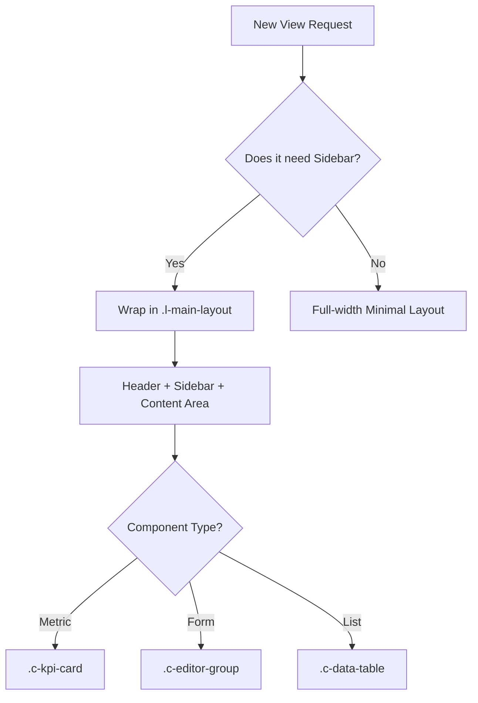

## 🎯 Strategic Intent
- **Goal**: Standardize the application's "Shell" and components using CSS Variables (Design Tokens) and modular SCSS.
- **Guardrails**: No hardcoded colors/spacing. All components must react to the global theme variables via the ThemeService.
- **Aesthetic**: Dark-first trading dashboard. Colors convey market semantics (green = gain, red = loss, blue = neutral/info).

## 🛡️ Critical Patterns

### Pattern 1: Design Tokens & Dynamic Theming
> **Rule**: All colors and dimensions must come from these CSS variables. Variables must be defined for both light and dark modes.
```scss
// src/styles/_variables.scss
:root {
  // Theme-agnostic Tokens
  --spacing-sm: 0.5rem;
  --spacing-md: 1rem;
  --spacing-lg: 1.5rem;
  --radius-xl: 0.75rem;

  // Default Theme (Dark — primary for trading dashboards)
  --bg-app: #0d0f1a;
  --bg-surface: #161927;
  --bg-surface-2: #1e2235;
  --border-color: #2a2f45;
  --text-main: #e8eaf0;
  --text-muted: #7b82a0;
  --color-primary: #3b82f6;     /* Blue — neutral info */
  --color-gain: #22c55e;        /* Green — profit / positive */
  --color-loss: #ef4444;        /* Red — loss / negative */
  --color-warning: #f59e0b;     /* Amber — caution */
}

// Light Theme Overrides
body.theme-light {
  --bg-app: #f4f6f8;
  --bg-surface: #ffffff;
  --bg-surface-2: #f0f2f7;
  --border-color: #e0e4ef;
  --text-main: #1a1d2e;
  --text-muted: #6b7280;
  --color-primary: #2563eb;
}
```

### Pattern 2: Component Architecture (BEM)
> **Rule**: Use BEM naming convention. Components use variables, unaware of the active theme.
```scss
// Example: Product Card Component
.c-card {
  background: var(--bg-surface); // Changes automatically based on body class
  border: 1px solid var(--border-color);
  border-radius: var(--radius-xl);
  padding: var(--spacing-lg);

  &__header {
    display: flex;
    justify-content: space-between;
    margin-bottom: var(--spacing-md);
  }

  &--highlighted {
    border-color: var(--color-primary);
  }
}
```

### Pattern 3: Dynamic Theming (ThemeService)
> **Rule**: Theme switching must be handled by a centralized `ThemeService`.
> **Mechanism**: The service toggles a CSS class (e.g., `theme-dark`, `theme-light`) on the `document.body`.
```typescript
// theme.service.ts
@Injectable({ providedIn: 'root' })
export class ThemeService {
  private renderer: Renderer2; // Injected via factory or component
  private _theme = new BehaviorSubject<'light' | 'dark'>('light');

  setTheme(theme: 'light' | 'dark') {
    this._theme.next(theme);
    if (theme === 'dark') {
        document.body.classList.add('theme-dark');
        document.body.classList.remove('theme-light');
    } else {
        document.body.classList.add('theme-light');
        document.body.classList.remove('theme-dark');
    }
  }
}
```

---

## 🧠 Reasoning Protocol
Before generating SCSS/HTML, the agent MUST:
1. **Identify the Slot**: Is it a Shell component (Sidebar/Header) or a Content component (Card/Table)?
2. **Variable Check**: Map every color to a `--var`. Ensure the variable has a definition for both Light and Dark modes.
3. **Zoneless Performance**: Ensure styles don't trigger layout shifts (CLS).

---

## 🌳 Decision Tree (Layout Hierarchy)


---

## 📑 Layout Contract (The Skeleton)
The agent must follow this HTML structure for all main views:
```html
<div class="l-app">
  <aside class="l-sidebar"> </aside>
  <div class="l-main">
    <header class="l-header"> </header>
    <main class="l-content">
      <div class="container-max">
        </div>
    </main>
    <footer class="l-footer"> </footer>
  </div>
</div>

[View Full Example Layout](assets/example-layout.md)
```

---

## ❌ Anti-Patterns (Hallucination Prevention)
- ❌ **Forbidden**: Hardcoded hex codes in components.
- ❌ **Forbidden**: Logic-based styling in TS (use CSS variables).
- ❌ **Forbidden**: Using `px` for spacing/font (Use `rem`).
- ❌ **Forbidden**: Using `@import` (Use modern `@use` or `@forward`).
---
