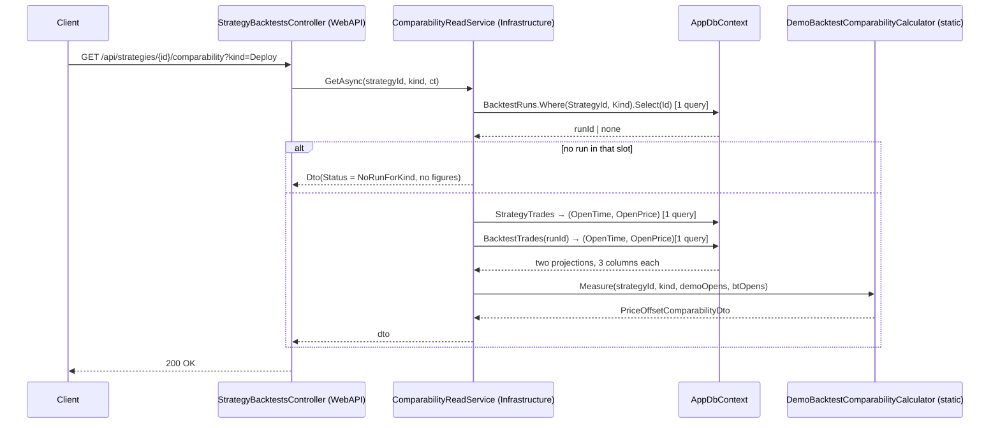

# Design: Cost reconciliation and divergence — SLICE A (price-series comparability)

> Scope: **slice A only**, backend only. Slice B (cost decomposition) and slice C (`SourcePlatform`)
> are designed *around*, not designed. Where a slice-A decision binds B, it is marked **[binds B]**.

## Technical Approach

Two thin server-side projections (`StrategyTrade`, `BacktestTrade` → `(OpenTime, OpenPrice)`) feed a
stateless static calculator that pairs opens by **exact truncated minute**, aggregates the signed
offset per calendar month, and returns one sealed Application DTO whose comparability caveat is a
**computed, non-nullable** property. One read endpoint. No migration, no write path, no threshold.

Sign convention, fixed on the type: `demo.OpenPrice − backtest.OpenPrice`.

## Architecture Decisions

### D1 — Pairing key is the raw open minute, on both sides, with no timezone conversion

**Choice**: key = `OpenTime` truncated to the minute, `DateTimeKind` untouched, both sides.
**Rejected**: normalizing either side to UTC or to the SQX Data Manager's `UTC+02 Jerusalem`.
**Rationale**: A2 — this is exactly what produced the measured 24 pairs; applying a conversion now
would invalidate the only evidence the change has. A correction also cannot be *silent*: neither
`StrategyTrade` nor `BacktestTrade` records a timezone, so any conversion would be an assertion, not
a read.

### D2 — DST divergence is disclosed, never corrected, and it disclosed itself already

**Choice**: each month row carries a non-nullable computed `DstTransitionRisk`, `TransitionMonth`
when `Month ∈ {3, 10, 11}`, else `None`. No transition *date* is computed.
**Rejected**: (a) computing US/Israeli transition dates — requires a tzdata version the app does not
carry and the SQX `DST: Yes` flag does not identify; (b) excluding transition months — withholds a
figure on a calendar rule rather than on evidence.
**Rationale**: an hour shift moves the minute key, so a DST divergence does **not** corrupt an
offset — the affected trades simply **stop pairing**. The failure signature is a collapse in that
month's `PairedCount`, which the DTO already reports beside every figure. The flag names the months
where that reading applies; `{3,10,11}` over-includes deliberately, and over-inclusion of a
disclosure is safe in a way that under-inclusion is not.

### D3 — The caller names the run kind. There is no default.

**Choice**: `BacktestRunKind Kind` is a **required** request parameter. A strategy with no run in
that slot returns `NoRunForKind`; it never falls back to the other slot.
**Rejected**: (a) defaulting to `Deploy` — `BacktestRunKind.Deploy = 0`, the same silent-assertion
hazard as `PlatformType.MT4 = 0` in D4; (b) reporting both runs — the measurement covered both
(42 Deploy / 39 Evaluation against 47 demo) and they answer *different* questions; presenting them
side by side invites reading the flattering one.
**Rationale**: `RunSegmentSelection` already fixed this: `(StrategyId, Kind)` is unique, so this is
"a CHOICE among at most two rows, never a search". The choice belongs to the operator.

### D4 — An ambiguous minute is refused, counted, and disclosed — never resolved

**Choice**: if **either** side has ≥2 opens in the same minute, that minute is excluded from
pairing. Its trades land in `AmbiguousMinuteDemoCount` / `AmbiguousMinuteBacktestCount`, a fourth
disjoint bucket — never in `DemoOnly` / `BacktestOnly`.
**Rejected**: (a) pairing by ticket or `RowIndex` order — deterministic but arbitrary, and a stable
wrong pairing is worse than none because it publishes a number; (b) pairing by nearest price —
circular, the price offset is the measurand.
**Rationale**: set membership, not ordering, decides — so it satisfies the byte-identical
determinism requirement (`backtest-portfolio-analytics/spec.md:251-252`) without an RNG or a
tie-break.

### D5 — No minimum paired count. The count is published beside every figure.

**Choice**: figures are published for `PairedCount ≥ 1`; the offset fields are `null` only where the
arithmetic is undefined (`PairedCount == 0`). Status defaults to `NoPairedOpens = 0`.
**Rejected**: an analogue of `AnalyticsSeries.MinHistoryDays = 90` or the `portfolio-monthly-var`
density gate.
**Rationale**: both precedents are *recorded user decisions*, not derived numbers. Inventing one
here is exactly what `INDEX.md` §5 forbids, and n = 1 gives no basis to calibrate it. The reader
judges sufficiency from `PairedCount`, which no call site can obtain the DTO without.

### D6 — `ComparabilityBasis` is computed and non-nullable; the DTO is a sealed record

**Choice**: mirror the `ServiceGuardrailDto.BreachBasis` precedent — a get-only computed property,
here constant (`PairedOpensOnly = 0`), because there is exactly one basis and the point is that no
call site can construct the DTO *without* it.
**Rejected**: `BacktestNetSeries`' private-constructor + nested-factory pattern.
**Rationale**: that pattern buys enforcement only when the factory can live in the same program
text. The calculator must sit in `Infrastructure/Services` beside `PortfolioAnalyticsCalculator`, so
a private constructor would drag the pairing algorithm into Application. Placement wins; the caveat
is still non-droppable because it is computed, not a defaulted parameter.

### D7 — `MeanOffsetPriceUnits`, not `MeanOffsetPoints`

**Choice**: rename the proposal's `…Points` fields to `…PriceUnits`.
**Rationale**: no instrument-specification table exists, so no tick size is read and no conversion is
performed. The figure is a raw price difference. It equals points only where tick size is 1 — true
for `NDX_DARWINEX` per the measured config, and not asserted for anything else. Calling it "points"
would name a conversion the code does not do. Values are unchanged (+22.06 / +22.55 / +40.90).

### D8 — No aggregated score, and no rank field on the type

**Choice**: the DTO exposes per-month rows only. Cross-strategy ordering is `|mean offset|` of the
**latest month with pairs**, applied by the consumer.
**Rejected**: a whole-window mean as the ranking key — the measured offset *drifts* (22 → 41 in two
months), so a whole-window mean understates the current state; and any scalar on the type would be
read as a grade.

### D9 — REST `HttpGet` beside the existing sibling, not GraphQL

`backend-core.md` routes queries to GraphQL, but `StrategyBacktestsController` already serves
`[HttpGet("backtests")]` on `api/strategies/{strategyId:guid}`. Following the sibling keeps one
surface; the convention tension is recorded rather than silently resolved.

### D10 — Disjoint-subset **P/L** ships in slice A (corrected)

**Superseded.** This decision originally deferred disjoint-subset P/L to slice B, reporting counts
only. That was drift, not scope: the approved proposal states the P/L explicitly as slice-A work,
and the spec requirement "The Trade-Set Difference Is Reported As A Set Relationship, Never As A
Score" demands it in two scenarios. `sdd-verify` raised the gap as CRITICAL; the correction
implements it here rather than descoping the spec.

**Choice**: each disjoint subset reports its own net P/L on the root DTO —
`PairedDemoNetPl`, `PairedBacktestNetPl`, `DemoOnlyNetPl`, `BacktestOnlyNetPl`,
`AmbiguousMinuteDemoNetPl`, `AmbiguousMinuteBacktestNetPl` — `null` only where the arithmetic is
undefined (empty subset, or an observation carrying no net). None feeds the offset, and no combined
or differenced figure exists.
**Cost asymmetry, not flattened**: demo net is `Profit + Commission + Swap + Taxes`
(`AnalyticsSeries.NetOf`); a backtest `Profit` already includes commission and spread and excludes
swap. A new `NetPlBasis` enum surfaces as two **computed, non-nullable** properties
(`DemoNetPlBasis`, `BacktestNetPlBasis`) — the D6 mechanism reused, not the existing `Basis`
overloaded, whose meaning (offsets are paired-subset-only) would otherwise blur.
**Rationale**: without each subset's value a reader cannot tell what SHARE of the P/L the offset
covers. The two figures are reported side by side because each subset needs its own value, never as
a comparison or a winner. Slice B (cost decomposition) is unaffected.

## Data Flow

```
Controller ─→ IDemoBacktestComparabilityReadService ─→ 2 IQueryable projections ─→ DbContext
                                │
                                └─→ DemoBacktestComparabilityCalculator (static, pure)
                                            └─→ PriceOffsetComparabilityDto
```

### Sequence — the read path (cross-layer)



## File Changes

| File | Action | Description |
|---|---|---|
| `Domain/Enums/ComparabilityBasis.cs` | Create | `PairedOpensOnly = 0`. Mirrors `BreachBasis`. |
| `Domain/Enums/DstTransitionRisk.cs` | Create | `None = 0`, `TransitionMonth = 1` (D2). |
| `Domain/Enums/NetPlBasis.cs` | Create | Per-side net-P/L cost basis (D10, corrected). |
| `Domain/Enums/ComparabilityReadoutStatus.cs` | Create | `NoPairedOpens = 0`, `Measured`, `NoDemoTrades`, `NoRunForKind`. Default asserts nothing. |
| `Application/DTOs/Divergence/PriceOffsetComparabilityDto.cs` | Create | Root DTO + `MonthlyPriceOffsetDto`. |
| `Application/Interfaces/IDemoBacktestComparabilityReadService.cs` | Create | One method. |
| `Infrastructure/Services/DemoBacktestComparabilityCalculator.cs` | Create | `internal static`, pure. The whole algorithm. |
| `Infrastructure/Services/DemoBacktestComparabilityReadService.cs` | Create | 2–3 projections, no entity materialization. |
| `WebAPI/Controllers/StrategyBacktestsController.cs` | Modify | One `[HttpGet("comparability")]`. Existing actions untouched. |
| `Infrastructure/DependencyInjection.cs` | Modify | One registration. |
| `tests/…/Divergence/DemoBacktestComparabilityCalculatorTests.cs` | Create | Core algorithm. |
| `tests/…/Divergence/ComparabilityContractTests.cs` | Create | Reflection/contract + determinism tripwires. |
| `tests/…/Divergence/DemoBacktestComparabilityReadServiceTests.cs` | Create | Query shape + statuses. |
| `tests/…/Divergence/DisjointSubsetNetPlTests.cs` | Create | Per-subset net P/L + basis asymmetry (D10, corrected). |
| `tests/…/StrategyBacktestsControllerTests.cs` | Modify | **Gains** cases; existing cases byte-identical. |

**No existing test is expected to break.** Nothing on an existing path is modified, so backend
**607/607 → ≥607, 0 warnings** holds. The `BacktestPortfolioRiskTripwireTests` file-scoped greps
target that slice's file list and do not see these files; slice A adds its own equivalents.

## Interfaces / Contracts

```csharp
// Infrastructure — pure input, no EF types.
internal readonly record struct OpenObservation(DateTime OpenTime, decimal OpenPrice);

internal static class DemoBacktestComparabilityCalculator
{
    // Deterministic: minute key = OpenTime.Ticks - (Ticks % TimeSpan.TicksPerMinute), Kind untouched.
    // Months emitted ascending by (Year, Month); pairs iterated in minute order. No rounding here.
    // NOTE: exact-minute pairing is correct ONLY for MEASURING an offset — it needs no tolerance
    // rule, because either the minute matches or it does not. It is WRONG for MERGING the two
    // series into one (proposal D5). Do not generalize this key to composition.
    public static PriceOffsetComparabilityDto Measure(
        Guid strategyId,
        BacktestRunKind kind,
        IReadOnlyList<OpenObservation> demoOpens,
        IReadOnlyList<OpenObservation> backtestOpens);
}
```

```csharp
// Application DTO (sealed records; offsets are demo − backtest, raw price units — D7).
public sealed record PriceOffsetComparabilityDto(
    Guid StrategyId,
    BacktestRunKind Kind,
    ComparabilityReadoutStatus Status,
    int PairedCount,
    int DemoOnlyCount,
    int BacktestOnlyCount,
    int AmbiguousMinuteDemoCount,
    int AmbiguousMinuteBacktestCount,
    IReadOnlyList<MonthlyPriceOffsetDto> Months)
{
    // Computed, non-nullable: the figures are measured over PAIRED OPENS ONLY, and no call site
    // can construct this DTO without saying so (BreachBasis precedent — D6).
    public ComparabilityBasis Basis => ComparabilityBasis.PairedOpensOnly;
}

public sealed record MonthlyPriceOffsetDto(
    int Year, int Month, int PairedCount,
    decimal? MeanOffsetPriceUnits, decimal? MinOffsetPriceUnits, decimal? MaxOffsetPriceUnits,
    int PositiveCount, int NegativeCount, int ZeroCount)
{
    public DstTransitionRisk DstRisk =>
        Month is 3 or 10 or 11 ? DstTransitionRisk.TransitionMonth : DstTransitionRisk.None;

    public decimal? SignConsistency => PairedCount == 0
        ? null : (decimal)Math.Max(PositiveCount, NegativeCount) / PairedCount;
}
```

**Set invariants** (pinned by test): `PairedCount + DemoOnlyCount + AmbiguousMinuteDemoCount ==
demoOpens.Count`, and the same for the backtest side. The four buckets are disjoint and exhaustive.

## Cost of evaluation (question E)

| Dimension | Figure |
|---|---|
| Per strategy | 2 dictionary builds, `O(n + m)`; n ≤ 726 backtest opens, m ≈ 50 demo opens |
| Cross-strategy worst case | 123 × ~776 rows × 3 columns ≈ 95k narrow rows, single-digit MB |
| Today's real load | **1 strategy** — the only one with both sides loaded |
| Precomputation | **None.** No cache, no materialized column, no persisted figure |

Constraint for any future cross-strategy readout: **two queries total, not one per strategy** — the
`RunSegmentSelection.SegmentRows` / `OosWindow.Resolver.ReadinessRows` precedent. Slice A ships the
per-strategy endpoint; the cross-strategy ranked list is deferred to proposal open question 3, now
informed by these numbers.

## Testing Strategy (strict TDD — every row RED first)

| # | Test | What it pins |
|---|---|---|
| 1 | `Measure_MeasuredFixture_ReproducesTwentyFourPairsAndMonthlyMeans` | The committed measured case: 24 pairs, +22.06 / +22.55 / +40.90 |
| 2 | `Measure_OpenTimesDifferingInSeconds_PairsOnTheTruncatedMinute` | Truncation, not equality |
| 3 | `Measure_OpenTimesOneHourApart_DoNotPair` | D2 — a DST shift breaks pairing rather than corrupting an offset |
| 4 | `Measure_MarchOctoberNovemberMonths_ReportTransitionRisk` | D2 flag, and `None` for other months |
| 5 | `Measure_TwoDemoOpensInOneMinute_ExcludesThatMinuteAndCountsItAmbiguous` | D4 refusal |
| 6 | `Measure_TwoBacktestOpensInOneMinute_ExcludesThatMinuteAndCountsItAmbiguous` | D4 on the other side |
| 7 | `Measure_AnyInput_BucketsArePartitionsOfBothSides` | The set invariants |
| 8 | `Measure_NoPairedOpens_ReturnsNullFiguresAndZeroCountNotAScore` | D5 — undefined, not withheld |
| 9 | `Measure_SinglePairedTrade_StillPublishesTheFigureBesideTheCount` | D5 — no invented minimum |
| 10 | `Measure_MixedSigns_ReportsSignConsistencyBelowOne` | Sign consistency arithmetic |
| 11 | `Measure_CalledTwiceWithShuffledInput_ReturnsByteIdenticalOutput` | Determinism, order-independence |
| 12 | `Dto_ComparabilityBasis_IsComputedNonNullableAndHasNoSetter` | Reflection — D6, the caveat cannot be dropped |
| 13 | `Dto_ExposesNoAggregatedScoreOrGradeMember` | Reflection — D8, no score creeps in |
| 14 | `Tripwire_NoSliceFileUsesARandomNumberGeneratorOrSeed` | Determinism tripwire (existing precedent) |
| 15 | `Tripwire_NoSliceFileContainsANumericThreshold` | "No invented threshold" |
| 16 | `GetAsync_StrategyWithNoRunOfThatKind_ReturnsNoRunForKindAndNoFigures` | D3 — no fallback slot |
| 17 | `GetAsync_AnyStrategy_IssuesAtMostThreeQueriesAndMaterializesNoEntities` | Query shape (E) |
| 18 | `GetComparability_MissingKind_Returns400` | D3 — kind is required, never defaulted |
| 19 | `GetComparability_ValidRequest_Returns200WithBasis` | Endpoint wiring |

Integration tooling is not installed (`config.yaml: integration_tool_installed: false`); 16–19 are
unit tests over a mocked/SQLite-backed context, matching the existing controller tests.

## Threat Matrix

N/A — no routing, shell, subprocess, VCS/PR automation, executable-file classification, or
process-integration boundary. One authenticated read endpoint over existing tables.

## Migration / Rollout

**No migration.** Pure read path over existing tables. Rollback = delete the new files, revert two
modified files. No feature flag needed; the endpoint is additive and nothing calls it until the UI
lands (deferred).

## Sizing

| Part | Est. changed lines |
|---|---|
| Production (3 enums, 2 DTOs, interface, calculator, read service, 2 modified) | ~200–240 |
| Tests (19 cases + fixture derived from the measured case) | ~200–240 |
| **Total** | **~400–480** |

Honest note: the two most recent comparable slices overran their estimates (330 → 731, 670 → 1,709),
driven by per-field provenance doc comments — the same style this design mandates. Treat ~480 as a
floor, not a ceiling. `400-line budget risk: High` — `sdd-tasks` must forecast it and the delivery
decision belongs before apply, not during it.

## Open Questions

- [ ] **Direction is not part of the pairing key.** A demo *buy* and a backtest *sell* opening in the
      same minute would pair. `StrategyTrade.Type` ("buy"/"sell") and `BacktestTrade.Type` (SQX
      vocabulary) have not been verified as a mappable pair, so no normalization is asserted. D4's
      ambiguity refusal catches the common case (both sides trading twice) but not this one.
      Verifying the SQX `Type` vocabulary would close it cheaply.
- [ ] Proposal open question 3 — per-strategy detail vs cross-strategy ranked list. Slice A ships the
      per-strategy endpoint; D8 fixes the ordering rule for whichever is chosen.
- [ ] Proposal open question 1 — whether the SQX data symbol will be rebound. Changes prominence, not
      computation.

## Honesty statement

**Validated against n = 1 strategy.** Every figure this design reproduces comes from one strategy on
one demo account over one ~130-day window. Nothing here establishes that the offset generalizes,
and **nothing here may be read as demo outperforming the backtest** — 24 paired signals cannot
establish a direction, only that the paths diverge systematically and drift. The independent
"1 minute data tick" intrabar-path gap produces the same symptom and is *not* addressed: a clean
offset must not be read as "comparable". That caveat belongs in the DTO remarks.
